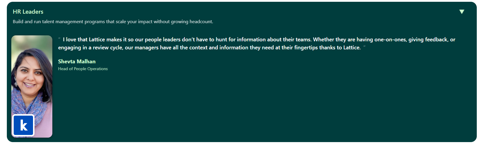

# 📝 Custom Accordion

A responsive and interactive **accordion component** built with **HTML, CSS, and JavaScript**, styled with **Bootstrap 5**.  
Each accordion item features images, logos, author details, and smooth open/close animations.



## 🚀 Features

- ✅ Responsive accordion design  
- ✅ Smooth slide open/close animation  
- ✅ Images with overlayed logos  
- ✅ Author name and position display  
- ✅ Custom arrow icon rotation on toggle  
- ✅ Mobile-friendly layout  


## 📂 Project Structure

```
project/
│── index.html # Main HTML file
│── README.md # Project documentation

```

## 🔧 Tech Stack

- **HTML5** – Semantic structure  
- **CSS3** – Styling and custom animations  
- **Bootstrap 5** – Responsive layout  
- **JavaScript** – Accordion toggle logic  

